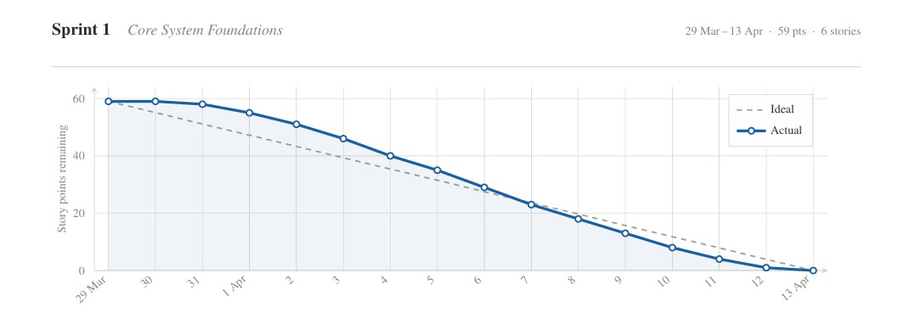

# Sprint 1 Burndown Chart — SD CareQueue

## Sprint Goal  
Implement core system foundations including authentication, patient dashboard, clinic discovery, appointment booking, and queue management.

---

## Burndown Chart  

---

## Summary  
The burndown chart shows a slower start at the beginning of the sprint, with minimal progress in the first few days. Progress improved steadily in the middle of the sprint as core features were implemented, followed by a consistent decline in remaining work toward the end. The team completed all planned story points by the end of the sprint.

---

## Notes  
- Slow initial progress due to setup and configuration  
- Strong mid-sprint productivity  
- All story points completed by sprint end  