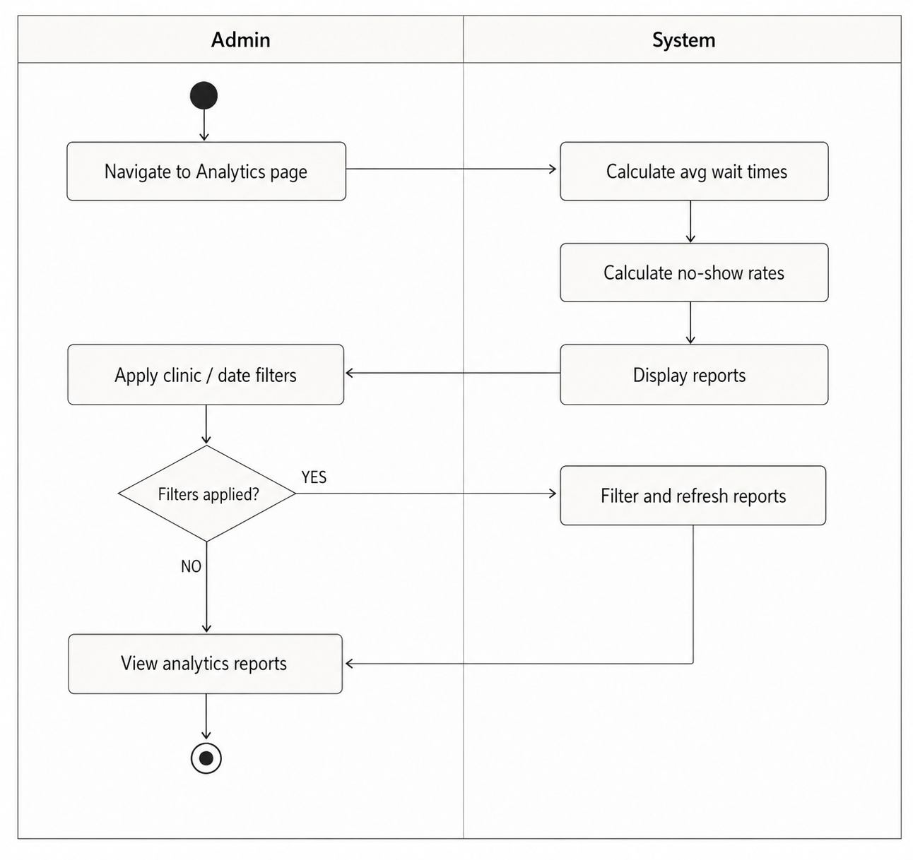
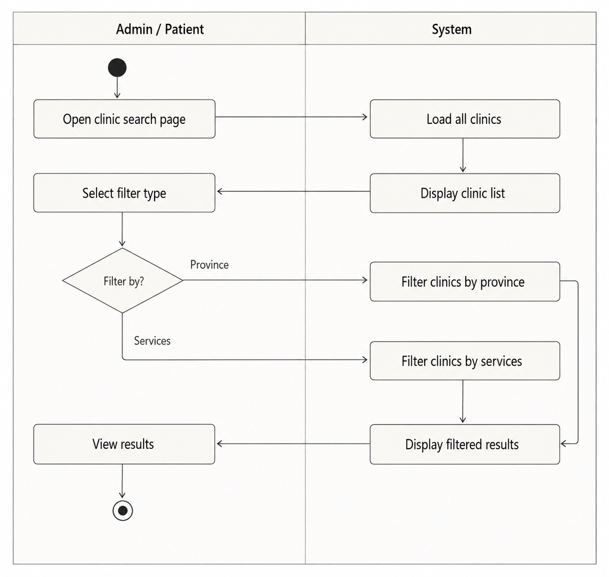

## 1. Activity Diagrams

### 1. Analytics Page
  
The analytics activity diagram shows how an admin accesses analytics reports, applies optional clinic or date filters, and the system recalculates and refreshes the reports before displaying the updated analytics data.

---

### 2. Staff Availability
  
The staff availability activity diagram illustrates how staff members manage and save their working availability by setting active days and working hours.

---

### 3. Clinic Filtering
  
The clinic search activity diagram shows how an admin or patient searches for clinics by selecting filters such as province or services, after which the system processes and displays the filtered clinic results.

