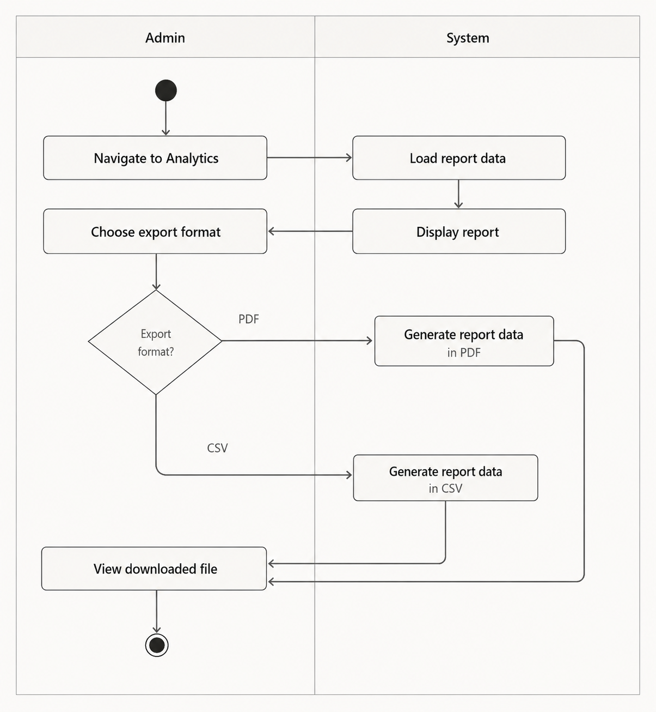
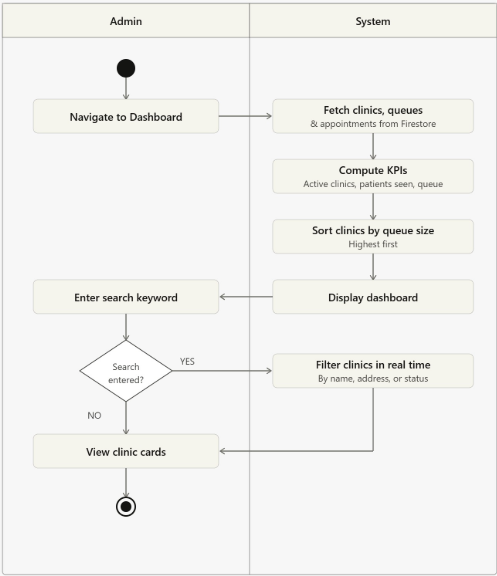

## 1. Activity Diagrams

### 1. Analytics Page
  
The export clinic reports activity diagram illustrates how administrators generate and download clinic data reports by navigating to the analytics page, where the system loads and displays report data, and the admin selects an export format, either PDF or CSV which the system then generates and delivers as a downloadable file.

---

### 2. Admin Dashboard
  
The admin dashboard activity diagram illustrates how administrators access and monitor clinic operations by navigating to the dashboard, where the system fetches and computes key performance indicators, sorts clinics by queue size, and allows real-time filtering of clinic cards by name, address, or status.

---

### 3. Admin change clinic hours
  
The admin dashboard activity diagram illustrates how administrators access and monitor clinic operations by navigating to the dashboard, where the system fetches and computes key performance indicators, sorts clinics by queue size, and allows real-time filtering of clinic cards by name, address, or status.

---
### 4. Patient Booking according to staff availability 
  
The admin dashboard activity diagram illustrates how administrators access and monitor clinic operations by navigating to the dashboard, where the system fetches and computes key performance indicators, sorts clinics by queue size, and allows real-time filtering of clinic cards by name, address, or status.

---
